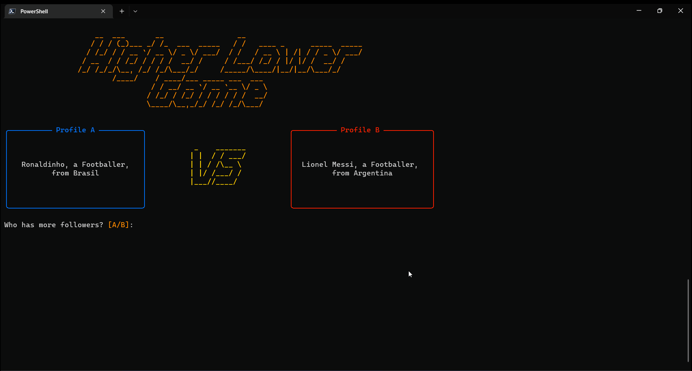

# Higher Lower Game



A CLI game for you to guess which social network profile has the most followers. Your score increases as you get it right, if you get it wrong, it's game over.<br>
Try to finish the game without making mistakes!

## Use [pipx](https://pypa.github.io/pipx/) to install or just run

### Requirements
- 3.10 >= [Python](https://www.python.org/) version < 3.11
- [git](https://git-scm.com/)
- [pipx](https://pypa.github.io/pipx/)
    

### Run from a temporary installation:

```
pipx run --spec git+https://github.com/ig0r-ferreira/higher-lower-game.git higherlowergame
```

### Install

```
pipx install git+https://github.com/ig0r-ferreira/higher-lower-game.git
```

You will now be able to run the application from anywhere on your system. For that, run:
```
higherlowergame
```
